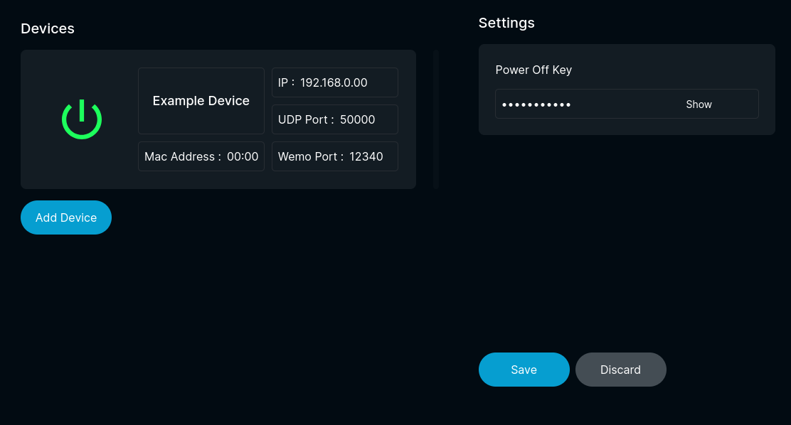

# Alexa-Wake-On-Lan
## A Fauxmo frontend that facilitates multi-device control via Alexa services by emulating wemo devices, enabling users to turn computers on/off seamlessly using voice commands.

Based on [fauxmo](https://github.com/n8henrie/fauxmo)

### Requirements:
- At least one computer capable of WOL
- A home server (could be a raspberry pi) running 24/7
- An amazon echo device

### Installing
- Via docker compose:
```yaml
---
version: "3.7"

volumes:
  alexa-wol:
    name: alexa-wol

services:
  alexa:
    image: cristianeduardmihai/alexa-wol:latest
    container_name: Alexa-WOL
    restart: unless-stopped
    network_mode: host
    environment:
      - TZ=Europe/Bucharest
    volumes:
      - alexa-wol:/alexa/api/config
```

### Configure devices

 - All configuration is done via the web ui.
 

### Compile windows binary (CLIENT PC)
- Download the `windows-binary` folder to your windows PC

- Download [rust](https://www.rust-lang.org/tools/install)

- Change `poweroff-securitykey` to `poweroff-yourkey`(that you puy in `api/secrets.json` in the previous step)

- Compile by double clicking `compile.bat` or running
```
rustc --target=x86_64-pc-windows-msvc --edition=2021 -o alexa_shutdown.exe shutdown.rs --crate-type bin
```
- Open the windows run menu and type `shell:startup`

- Place the compiled `alexa_shutdown.exe` in the folder

### Setup linux service (CLIENT PC)
- Download the `shutdown.py` file from the `linux-service` folder. Place it in a location you can remember

- Set your shutdown security key on the first line

- Install python packages (yes it should run as root)
```bash
sudo pip3 install sockets
```

- Create systemd services

Make sure to replace PATH with the location of your file.
```bash
printf "Description=Running alexa-shutdown on boot

[Service]
Environment=XDG_RUNTIME_DIR=/run/user/1000
ExecStart=/bin/bash -c 'python3 -u PATH/shutdown.py'
WorkingDirectory=PATH
Restart=always
User=root
[Install]
WantedBy=multi-user.target" > /lib/systemd/system/alexa-shutdown.service
```

- Enable and start services

```bash
sudo systemctl enable alexa-shutdown
sudo systemctl start alexa-shutdown
```


### Add your devices to alexa
After configuring everything, please restart your services
```bash
sudo systemctl restart api
sudo systemctl restart fauxmo
```

The, simply say
`Alexa, discover devices`

Alexa should respons with
```
Starting discovery,
...
```

After about a minute, alexa should say
```
I have found and connected X new devices
```